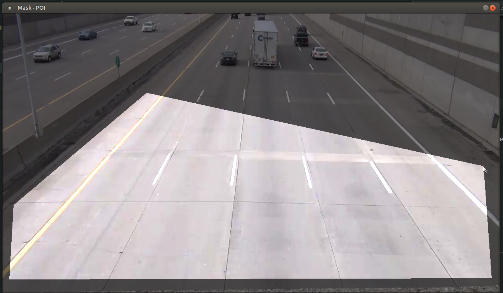
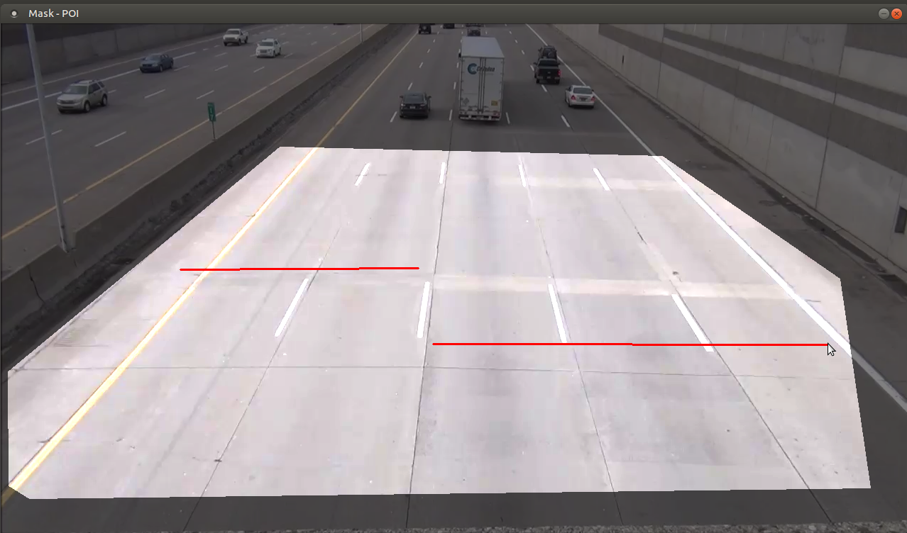
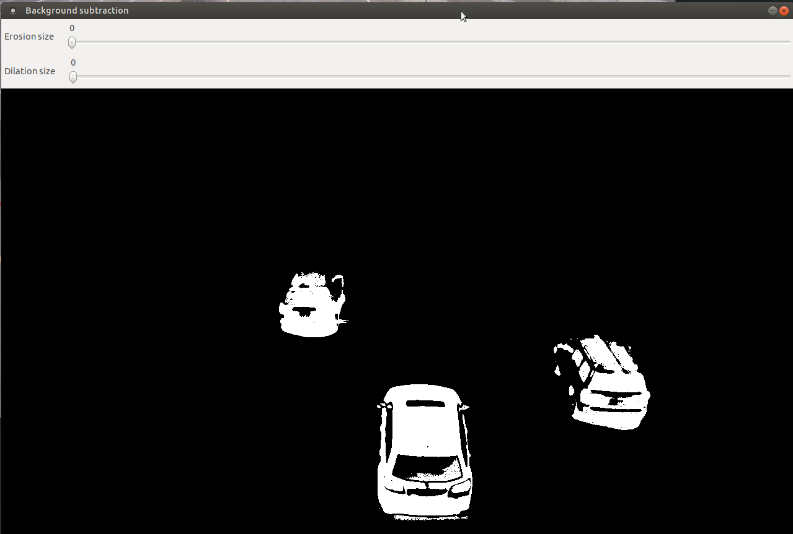
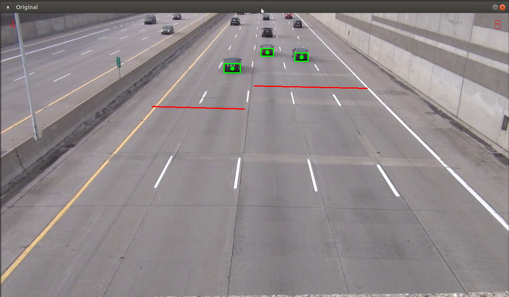

# car-counter

## About the project
Car counting based on image processing. Keywords: background subtraction kNN algorithm, morphology, selecting POI/mask, finding blobs/contours, convex hull.  
Build in C++ and OpenCV. Free to use, but code is not clean and well designed.

## Build OpenCV (from official [tutorial](https://docs.opencv.org/4.5.0/d7/d9f/tutorial_linux_install.html))

``` bash
# install g++, cmake and make
sudo apt install g++ cmake make

# download OpenCV 4.5 into folder opencv
cd opencv
mkdir build && cd build

# build
cmake -D ENABLE_PRECOMPILED_HEADERS=OFF -D CMAKE_BUILD_TYPE=Release -D CMAKE_INSTALL_PREFIX=/usr/local -D OPENCV_GENERATE_PKGCONFIG=ON ..
make -j8

# install
sudo make install
```

## Build car-counter

``` bash
# download car-counter into folder car-counter
cd car-counter
mkdir build && cd build

# build
cmake ..
make
```

## Run car-counter

``` bash
./car-counter <src to video> [-small]
```
>- src to video: example: ./video_1.mov
>- small: convert video to 640x480 format

### Select POI
When running the program, the window appears which lets you choose mask / points of interest for further image processing. So we limit image processing to selected area. After choosing the points, you need to **press number 2 on keyboard**.


### Select lines as counters
After pressing number 2 on keyboard, you need to select first line for which cars need to pass in order to increment the car counter. After selecting two points (start and end), you need to **press number 3 on keyboard** and repeat the step for second line. (If you want to deselect everything, you need to **press character c on keyboard**.) After selecting the second line, you need to **press number 4 on keyboard**.


### Try out with morphology and enyoy counting cars
After selecting area of interest and lines as triggers to increment counters, you have done everything to start counting cars with image processing. Two windows will appear. The first one will contain video with cars beeing detected and car counters. The second one will contain sliders for morphological operations (erosion and dilation) which you can tweek in order to increase the performance of car detection.


**Press ESC on keyboard** in order to exit the program. Enyoy.